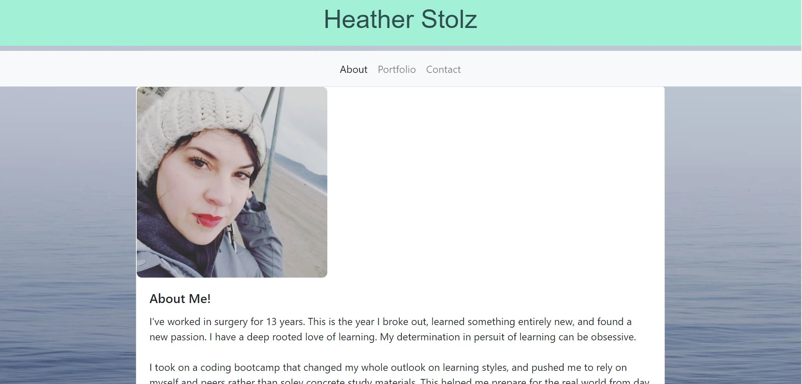

# React Portfolio

## Author

Heather Stolz

## Table of Contents:

* [Description](#description)
* [Installation](#installation)
* [Usage](#usage)
* [Improvements](#improvements)
* [links/Images](#Links/Images)
* [Questions](#questions)

## Description

This is the react adaptation of my portfolio that has been slowly altered as coding bootcamp progressed. Displaying info about me, some projects that I've completed, ways to check me out on other platforms, and to contact me by email.

## Installation

Please run these commands to install dependancies for this project: npm i

## Usage

To allow an employer and colleagues to see what work I've done and be able to reach out and connect with me.

## Improvements

* Styling- I'd like to revamp the look of this app. This is the first react rendition and definitely not the last.
* Projects- Update with more current projects.

## Links/Images

[Deployed App] https://blooming-anchorage-98818.herokuapp.com/

## Questions

If you have any questions regarding this project, you can find me at [Wanderingtech](https://github.com/Wanderingtech) 

and/or at heather86lyn@gmail.com.